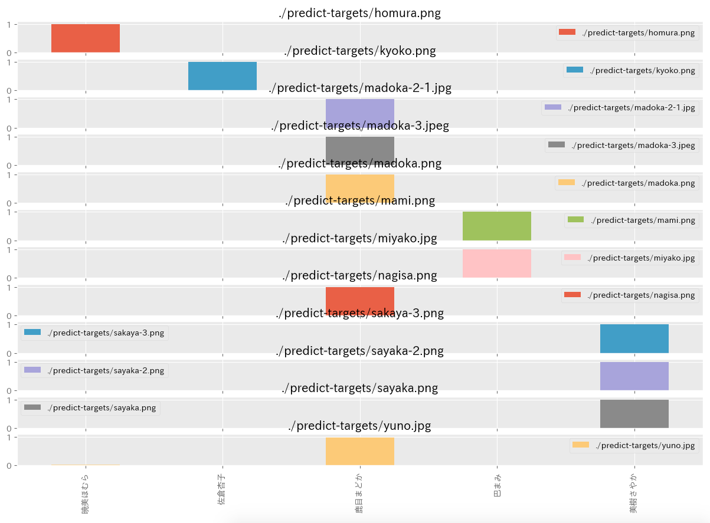
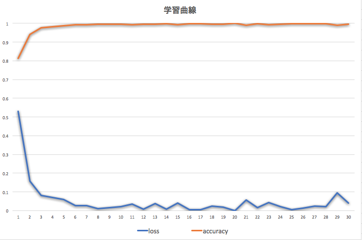

# 魔法少女分類器

## 概要
某魔法少女を顔識別＋機械学習tensorflow(keras)で自動的に識別します。   
craw_imageで学習用の画像データは収集できますが、結構GoogleAPIの設定がいろいろ面倒なので   
imagesディレクトリに放おっておきます。怒られたら消します。   


## 構成
```shell
.
├── README.md
├── kerasmodel.py       # ニューラルネットワーク生成用関数
├── crawl_image.py      # 1. 学習用のデータをGoogle 画像検索を使って収集します
├── analysis_images.py  # 2. 収集した画像データを水増しして、データ化します
├── keras_images.py     # 3. データ化した学習データを読み込んで、学習します
├── predict.py          # 4. 学習したデータを使って、predict-targetsの画像を分類する
├── bulk-images         # 水増しした学習データ
├── datas
│   ├── keras-models.h5   # 学習データ
│   └── numpy-models.npy  # データ化した画像
├── images                # クロールして収集した画像を収めるディレクトリ
├── lbpcascade_animeface
├── predict-targets       # 分類対象の画像ディレクトリ
└── requirements.txt
```

## Requirements
- Python3
- [requirements](requirements.txt)

## Setup
```bash
$ pip install -r requirements.txt
```

## 学習曲線



| 項目      | 値             |
| -------- | -------------- |
| loss     | 0.145392511125 |
| accuracy | 0.981818199158 |
